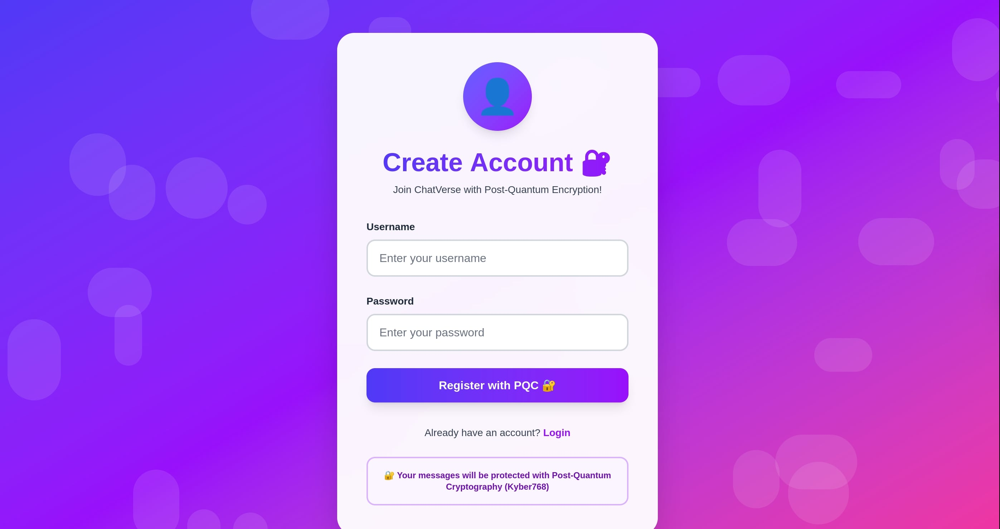
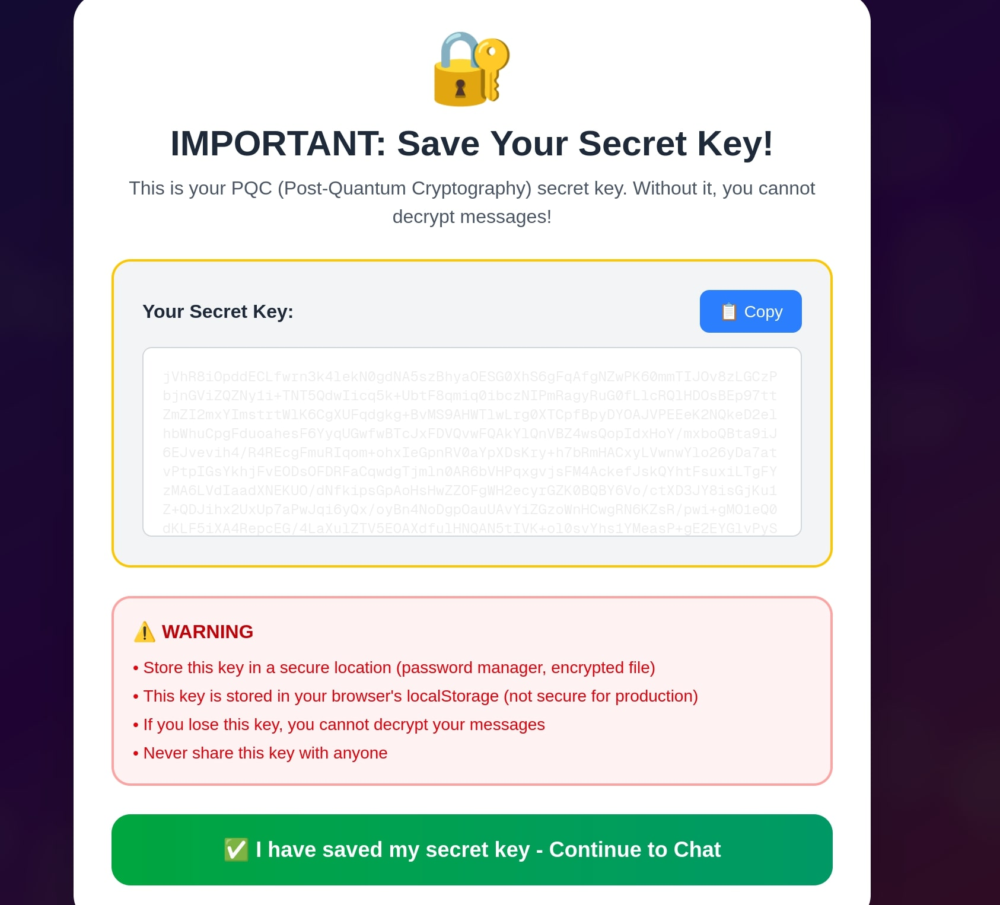
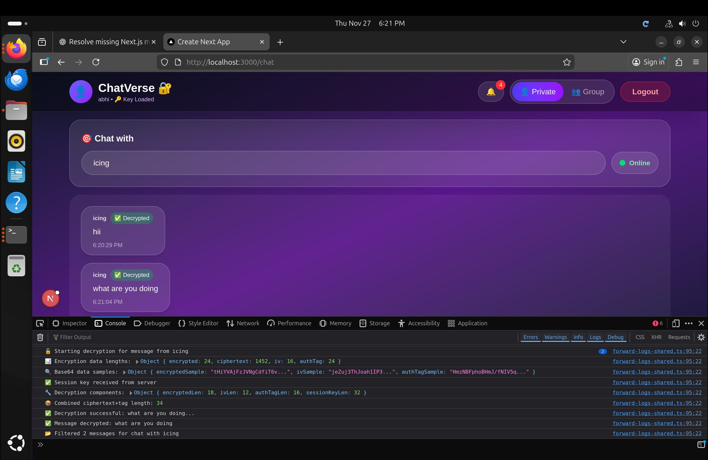

# 🔐 ChatVerse – Post-Quantum Secure Real-Time Chat Application

ChatVerse is a real-time, end-to-end encrypted chat platform that uses **Post-Quantum Cryptography (PQC)** to secure communication against future quantum attacks.
It is built using **Next.js, Node.js, Socket.io, MongoDB, Kyber768**, and **AES-256-GCM** hybrid encryption.

The application supports:

* Private chat
* Typing indicators
* Online/offline status
* Notifications
* Encrypted image sharing
* A modern UI with PQC-based key distribution

---

# 🖼️ Screenshots


### 🚪 Login Page



### 🔐 Registration + Post-Quantum Secret Key Page



### 💬 Real-Time Encrypted Chat (Two Users)



---

# 🚀 Features

### 🔐 **Post-Quantum Encryption (Kyber768 + AES-256-GCM)**

* Users receive a **Kyber PQC private key** during registration.
* Messages are encrypted using **AES-256-GCM**.
* AES session keys are encrypted using **Kyber768 KEM**.
* Fully quantum-resistant key exchange.

### 💬 **Real-Time Chat**

* One-to-one private chat
* Online/offline status
* Typing indicators
* Instant message delivery
* Message read/decrypted status
* New AES key per message (forward secrecy)

### 📸 **Encrypted Image Sharing**

* Images encrypted on client-side **before upload**.
* Server never sees plaintext images.

### 🔑 **Secure Key Handling**

* PQC private keys stay **only on client side**.
* Private keys **never** go to the server.
* AES session keys are generated per message.

### 🧩 **Modern UI**

* Next.js App Router + Tailwind CSS
* Secret key download page
* Chat UI with gradient themes
* Real-time notifications

---

# 📦 Tech Stack

### **Frontend**

* Next.js 14
* React
* Tailwind CSS
* WebCrypto API (AES-GCM)

### **Backend**

* Node.js
* Express
* Socket.io
* MongoDB + Mongoose

### **Cryptography**

* **Kyber768** (PQC KEM – Post-Quantum secure)
* **AES-256-GCM** (authenticated symmetric encryption)
* **Hybrid Encryption:** Kyber KEM + AES-GCM
* **native-crypto / node-liboqs** for PQC integration

---

# 📁 Project Structure (according to your folder)

```
chat-app/
 ├── app/                   # Frontend (Next.js pages)
 ├── server/                # Express + Socket.io backend
 ├── lib/                   # Crypto utilities (AES, PQC)
 ├── models/                # MongoDB schemas
 ├── native-crypto/         # PQC key generation (Kyber768)
 ├── public/                # Static assets
 ├── next.config.ts
 ├── package.json
 └── README.md              # This file
```

---

# 🛡️ Security Architecture

### **1️⃣ Registration**

* User creates an account.
* System generates **Kyber768 key pair**.
* User receives secret key (must be saved!).
* Server stores only the **public key**.

---

### **2️⃣ Sending a Message**

1. Client generates **new AES-256 session key**.
2. Encrypts message with AES-GCM.
3. Encapsulates AES key with receiver’s **Kyber public key**.
4. Sends encrypted payload over Socket.io.

---

### **3️⃣ Receiving a Message**

1. Recipient decapsulates AES key using **Kyber private key**.
2. Decrypts message using AES-GCM.
3. UI shows a **Decrypted** badge.

---

### **4️⃣ Forward Secrecy**

* Every message uses a **unique AES key**.
* Even if one key leaks, past messages remain safe.

---

# ⚙️ Installation

### **1. Install Dependencies**

```
npm install
```

### **2. Start Backend (Socket Server)**

```
node server/socket-server.js
```

### **3. Start Next.js Frontend**

```
npm run dev
```

### **4. Open Application**

```
http://localhost:3000
```

---

# 🧪 Testing Features

You can test:

✔ Two browsers → private chat
✔ PQC key generation & loading
✔ Encrypted message exchange
✔ Decryption badge on UI
✔ Online/offline status
✔ Typing indicator
✔ Encrypted image transfer

Your screenshots confirm fully working encrypted chat sessions.

---

# 🛡️ Important Security Notes

* Your **PQC secret key must be saved**.
  Without it, messages can **never** be decrypted.

* Keys are stored **only on client-side**.

* Server never stores PQC private keys.

* AES session keys are **never persisted**.

* Decryption failure message:

```
AES decryption failed – possible key mismatch
```

---

# ⭐ Learning Outcomes

This project demonstrates:

* Practical implementation of **Post-Quantum Cryptography**
* Usage of Kyber768 with AES-GCM hybrid encryption
* Secure real-time messaging architecture
* Cryptographically safe key lifecycle management
* Integrating PQC systems with modern full-stack applications
* Building scalable chat systems using Socket.io

---

