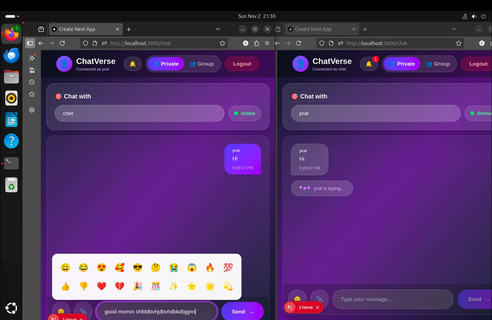
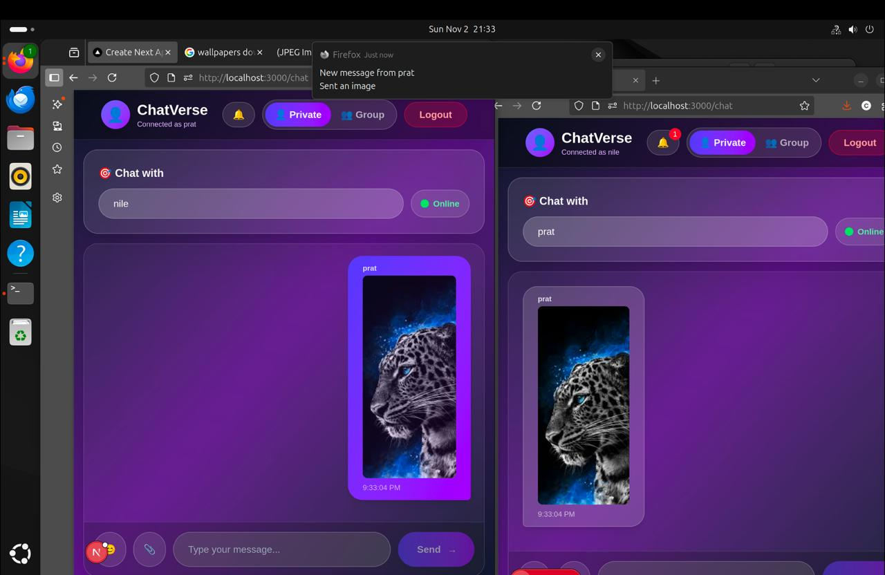

---


# 💬 ChatVerse – Real-Time Chat Application

ChatVerse is a **real-time chat application** built using **Next.js, Node.js, Express, Socket.io, and MongoDB**.  
It enables users to chat privately or in groups, send messages and images, receive live notifications, and view online/offline status — all through a smooth and elegant gradient UI.

---

## 🚀 Project Overview

ChatVerse provides:
- 🔐 Secure user login and registration.  
- 💬 Real-time one-to-one and group chat using Socket.io.  
- 📸 Instant image sharing with preview support.  
- 🟢 Online/offline user status visibility.  
- 🧠 Typing indicators and real-time notifications.  
- 🌈 Responsive and modern UI built with Tailwind CSS.

---

## ⚙️ Installation and Setup Guide

### 1️⃣ Clone the Repository
```bash
git clone https://github.com/MTech-IT-MNS-2025/Group-4.git
cd Group-4/Assignment-3
````

### 2️⃣ Install Dependencies

```bash
npm install
```

### 3️⃣ Start the Backend Server

```bash
node server/socket-server.js
```

### 4️⃣ Run the Frontend (Next.js)

In another terminal:

```bash
npm run dev
```

### 5️⃣ Open in Browser

Visit 👉 [http://localhost:3000](http://localhost:3000)

---

## 🏗️ Architecture Overview

```
chat-app/
 ├── app/                → Next.js frontend pages
 │   ├── page.tsx        → Main ChatVerse interface
 │   ├── api/            → API endpoints for messages, login, upload
 │
 ├── server/             → Express + Socket.io backend
 │   ├── socket-server.js → Real-time events (status, messaging)
 │
 ├── lib/                → MongoDB connection utilities
 │   └── mongodb.ts
 │
 ├── models/             → Mongoose schemas for message storage
 │   └── Message.ts
 │
 ├── public/             → Profile pictures, uploads, static assets
 │
 ├── package.json        → Dependencies and scripts
 ├── tailwind.config.ts  → Tailwind CSS configuration
 ├── tsconfig.json       → TypeScript setup
 └── README.md           → Project documentation
```

---

## 🧠 Technologies Used

| Category            | Technology                   |
| ------------------- | ---------------------------- |
| **Frontend**        | Next.js, React, Tailwind CSS |
| **Backend**         | Node.js, Express.js          |
| **Realtime Engine** | Socket.io                    |
| **Database**        | MongoDB (via Mongoose)       |
| **File Handling**   | Multer (for uploads)         |
| **Other Tools**     | CORS, Nodemon, TypeScript    |

---

## 🖼️ Screenshots

<div align="center">
  <h3>🔐 Login Page</h3>
  

  <h3>💬 Private Chat Interface</h3>
  

  <h3>🖼️ Image Sharing Feature</h3>
  
</div>

---

## 🎯 Learning Outcomes

This project helped us learn how to:

* Build **real-time bidirectional communication** with Socket.io.
* Handle **file uploads** (images, profile pictures) using Multer.
* Design modular **Next.js + Express architecture**.
* Manage user sessions and live **online/offline presence**.
* Build a fully **responsive chat interface** using Tailwind CSS.
* Integrate **browser notifications** and emoji picker UI.
* Work collaboratively using **Git & GitHub version control**.

---


## 🏁 Conclusion

ChatVerse showcases the power of combining **Next.js** and **Socket.io** for creating a truly interactive chat system.
It supports seamless file sharing, group chat, online status updates, and live notifications — delivering a complete real-time messaging experience.

---

⭐ *If you liked this project, don’t forget to star the repository!* 🌟

````

---

### ✅ Steps to Apply:
1. Create or open your file:  
   `Assignment-3/README.md`
2. Paste the above content.
3. Commit and push:
   ```bash
   git add README.md
   git commit -m "Added professional README with screenshots and architecture"
   git push
````

---


