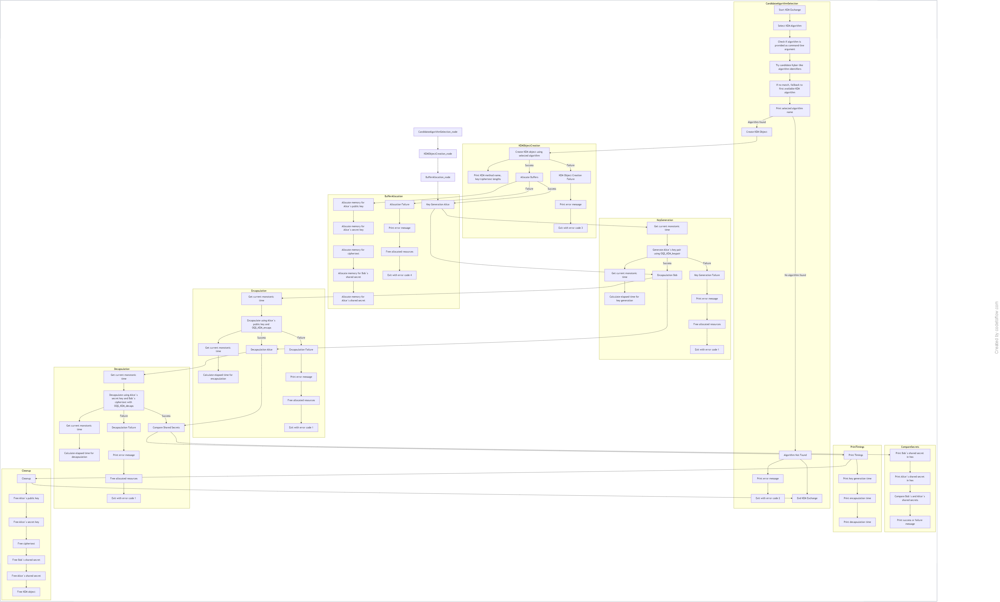

# Assignment 2
All Group 4 solutions for Assignment 2 will be stored here.

# 🧮 Task 1: Listing All Available Algorithms (liboqs)

## 🎯 Objective
The goal of this task is to **explore all post-quantum algorithms** supported in the local liboqs build and understand their basic properties such as key and ciphertext sizes.

---

## 🧠 Concept Overview

**liboqs** is an open-source C library developed by the **Open Quantum Safe (OQS)** project.  
It provides implementations of **Post-Quantum Cryptography (PQC)** algorithms — cryptosystems designed to remain secure against quantum attacks.

This task helps you identify which **KEMs (Key Encapsulation Mechanisms)** and **SIGs (Digital Signature Schemes)** are available in your build of liboqs.

---

## ⚙️ Features Implemented

The program (`list_algorithms.c`) lists:

- All **available KEM algorithms** (e.g., Kyber512, NTRU, BIKE, etc.)
- All **available Signature algorithms** (e.g., Dilithium, Falcon, SPHINCS+, etc.)
- For each KEM, it prints:
  - Algorithm name  
  - Public key length  
  - Secret key length  
  - Ciphertext length  

---

## 🧩 Functions & APIs Used

| Function | Description |
|-----------|--------------|
| `OQS_KEM_alg_count()` | Returns number of available KEM algorithms. |
| `OQS_KEM_alg_identifier(i)` | Returns the name (string) of the *i-th* KEM algorithm. |
| `OQS_SIG_alg_count()` | Returns number of available Signature algorithms. |
| `OQS_SIG_alg_identifier(i)` | Returns the name (string) of the *i-th* Signature algorithm. |
| `OQS_KEM_new(name)` | Initializes a KEM object for that algorithm. |
| `OQS_KEM_free()` | Frees allocated memory for KEM structure. |
| `OQS_SIG_new(name)` | Initializes a Signature object for that algorithm. |
| `OQS_SIG_free()` | Frees allocated memory for SIG structure. |

---


# 🧩 Task 2: KEM Exchange Utility (`kem_exchange`)

The `kem_exchange` utility is a **command-line tool** designed for **testing, benchmarking, and validating Key Encapsulation Mechanisms (KEMs)**, primarily leveraging algorithms from the **Open Quantum Safe (OQS) library**.

It focuses on **Post-Quantum Cryptography (PQC)** algorithms recommended or under evaluation by the **National Institute of Standards and Technology (NIST)**, including the **CRYSTALS-Kyber/ML-KEM** family.

---
---

## 📊 System Flowchart

The following flowchart illustrates the **overall workflow** of the `kem_exchange` utility — covering key generation, encapsulation, decapsulation, and shared secret verification processes.

<p align="center">
  
</p>

---

## 🚀 Overview

The utility performs a full KEM exchange simulation between **Alice** and **Bob**, executing all fundamental cryptographic operations — key generation, encapsulation, decapsulation, and shared secret verification.

---

## ⚙️ Core Operations

The exchange workflow consists of four main steps:

1. **Key Generation:** Alice generates a public/secret key pair.  
2. **Encapsulation:** Alice uses Bob’s public key to produce a ciphertext and a shared secret (Alice’s secret).  
3. **Decapsulation:** Bob uses his secret key and Alice’s ciphertext to derive a matching shared secret (Bob’s secret).  
4. **Verification:** The tool compares both shared secrets to confirm exchange validity.

---

## 🧾 Example Output

The utility outputs algorithm information, key/data sizes, timing metrics, and a verification message.

| Field | Description | Example Output |
| :--- | :--- | :--- |
| **Algorithm** | Displays the KEM name and version under test. | `Using KEM: %s`, `Selected candidate algorithm: %s`. |
| **Key/Data Sizes** | Reports the lengths of public key, ciphertext, and shared secret. | `public key len : %zu`, `ciphertext len : %zu`, `shared secret len: %zu` |
| **Timings** | Shows latency for each cryptographic operation. |`Key generation : %.3f ms`, `Encapsulation : %.3f ms`, `Decapsulation : %.3f ms` |
| **Verification** | Indicates whether the secrets matched successfully. | `Success: shared secrets match!`, `FAIL: shared secrets differ!` |

---

## 🔐 Supported Algorithms

The utility supports multiple PQC KEM families and their respective security levels:

| Algorithm Family | Variants |
| :--- | :--- |
| **ML-KEM (Kyber)** | `Kyber512`, `Kyber768`, `Kyber1024`, `ML-KEM-512`, `ML-KEM-768`, `ML-KEM-1024`. |
| **Classic McEliece** | `Classic-McEliece-348864`, `Classic-McEliece-460896f`, `Classic-McEliece-8192128` |
| **NTRU / SNTRUP** | `NTRU-HPS-2048-509`, `NTRU-HRSS-701`, `sntrup761` |
| **BIKE** | `BIKE-L1`, `BIKE-L3`, `BIKE-L5` |
| **FrodoKEM** |`FrodoKEM-640-AES`, `FrodoKEM-976-SHAKE`, `FrodoKEM-1344-AES` |
| **HQC** | `HQC-128`, `HQC-192`, `HQC-256` |

---

## 🧠 Technical Dependencies

The tool depends on several essential libraries to provide cryptographic robustness, system functionality, and performance optimizations.

### **Core Libraries**

- **OpenSSL (`libcrypto.so.3`)**  
  Used for cryptographic primitives such as hashing (`SHA256`, `SHAKE128` ), encryption modes (`AES-128-CTR` ), and randomness sources (`RAND_bytes`, `RAND_poll` ).

- **Standard C Library (`libc.so.6`)**  
  Provides memory management (`malloc`, `free` ) and I/O operations (`puts`, `perror` ).

### **Compiler / Platform Optimizations**

- Support for CPU acceleration using instruction sets such as `AVX2` and `AVX512` for optimized cryptographic computations.

---

✅ **Summary:**  
The `kem_exchange` utility serves as a **comprehensive benchmarking and validation framework** for **post-quantum key exchange mechanisms**, providing both correctness verification and performance insights across a variety of PQC algorithms.


# 📝 **Task 3: Digital Signature Demo (`sig_demo`)**

`sig_demo.c` demonstrates **Digital Signatures** using **Post-Quantum Cryptography (PQC)** and **classical cryptography** (RSA-2048 and ECDSA-P256).
It highlights **key generation, signing, verification**, **key & signature sizes**, and **execution timings**.

---

## 🚀 Features

| Type           | Algorithms                        | Features                                                                                      |
| -------------- | --------------------------------- | --------------------------------------------------------------------------------------------- |
| **PQC**        | Dilithium2/3/5, ML-DSA (fallback) | Key generation, signing, verification, Hexadecimal signature output, Timing measurements (ms) |
| **Classical**  | RSA-2048                          | SHA-256 signing, Key & signature sizes, Verification                                          |
| **Classical**  | ECDSA-P256                        | SHA-256 signing, Compact key (~65 bytes), Signature size ~64–72 bytes, Verification           |
| **Comparison** | All                               | Performance comparison between PQC and classical signatures                                   |

---

## 📝 Table of Contents

* [Overview](#overview)
* [Dependencies](#dependencies)
* [Installation](#installation)
* [Compilation](#compilation)
* [Usage](#usage)
* [Algorithm Details](#algorithm-details)
* [Sample Output](#sample-output)
* [Contributing](#contributing)
* [License](#license)

---

## 🔍 Overview

This project demonstrates digital signatures by:

1. Generating **public/private key pairs** for PQC and classical algorithms
2. Signing a sample message:

```
"Post-Quantum Cryptography is the future"
```

3. Verifying the signature
4. Measuring execution time for **key generation**, **signing**, and **verification**
5. Printing **key sizes** and **signature lengths**

---

## 🧩 Dependencies

| Dependency                   | Purpose                  |
| ---------------------------- | ------------------------ |
| GCC                          | Compiler                 |
| OpenSSL (`libssl-dev`)       | RSA, ECDSA, SHA-256      |
| Open Quantum Safe (`liboqs`) | PQC signature algorithms |

**Ubuntu/Debian Installation:**

```bash
sudo apt update
sudo apt install build-essential libssl-dev cmake ninja-build git
```

**Build and Install liboqs:**

```bash
git clone --branch main https://github.com/open-quantum-safe/liboqs.git
cd liboqs
mkdir build && cd build
cmake -GNinja -DCMAKE_INSTALL_PREFIX=/usr/local ..
ninja
sudo ninja install
```

---

## ⚙️ Compilation

```bash
gcc -O2 -o sig_demo sig_demo.c -I/usr/local/include -L/usr/local/lib -loqs -lcrypto
```

---

## 🏃 Usage

```bash
LD_LIBRARY_PATH=/usr/local/lib ./sig_demo
```

Program workflow:

1. Select a PQC algorithm (**Dilithium2 preferred**)
2. Generate **public/private keys**
3. Sign and verify the sample message
4. Print **signature in hexadecimal**
5. Display **timings**, **key sizes**, and **verification results**

---

## 🔑 Algorithm Details

| Algorithm            | Public Key Size | Secret Key Size | Signature Size | Notes                                                    |
| -------------------- | --------------- | --------------- | -------------- | -------------------------------------------------------- |
| **Dilithium2 (PQC)** | 1312 bytes      | 2528 bytes      | 2420 bytes     | OQS library, PQC security, measured timings in ms        |
| **RSA-2048**         | ~294 bytes      | N/A             | 256 bytes      | Classical, SHA-256 signed, measured timings              |
| **ECDSA-P256**       | ~65 bytes       | N/A             | 64–72 bytes    | Classical, compact key, SHA-256 signed, measured timings |

---

## 📊 Sample Output

| Algorithm            | Verification | KeyGen (ms) | Sign (ms) | Verify (ms) | Signature (hex, truncated) |
| -------------------- | ------------ | ----------- | --------- | ----------- | -------------------------- |
| **Dilithium2 (PQC)** | ✅ SUCCESS    | 2.345       | 0.456     | 0.123       | `12ab34cd...`              |
| **RSA-2048**         | ✅ SUCCESS    | 45.678      | 1.234     | 0.987       | `a1b2c3d4...`              |
| **ECDSA-P256**       | ✅ SUCCESS    | 0.456       | 0.123     | 0.078       | `abcd1234...`              |

---

## 🤝 Contributing

Contributions are welcome!

1. Fork the repository
2. Create a branch: `git checkout -b feature-name`
3. Commit changes: `git commit -am "Add feature"`
4. Push branch: `git push origin feature-name`
5. Open a Pull Request

---


